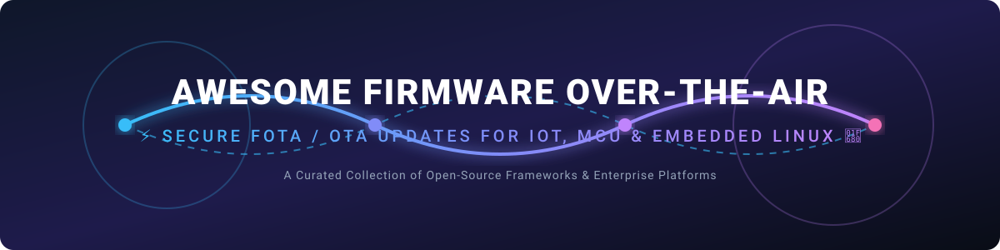

  

# ⚡ Awesome Firmware Over-The-Air (FOTA / OTA) 🚀

A curated list of leading platforms, frameworks, and tools for secure **Firmware Over-the-Air (FOTA)** and **Software Over-the-Air (OTA)** updates. Designed for IoT devices, embedded Linux systems, microcontrollers (MCU), and edge computing nodes — covering delta updates, A/B partitioning, fleet management, fail-safe rollback, device monitoring, and secure bootloader integration.

> **Primary focus: Open-Source Software and Enterprise Hosted Services.**

---

## 📋 Table of Contents
- [🏢 SaaS / Hosted Platforms](#-saas--hosted-platforms)
- [🔓 Open-Source Frameworks & Tools](#-open-source-frameworks--tools)
- [⚡ Quick Start Recommendations](#-quick-start-recommendations)
- [📈 Star History](#-star-history)
- [🤝 Contributing](#-contributing)

---

## 🏢 SaaS / Hosted Platforms

Below is a comparative breakdown of commercial and hosted FOTA/OTA device management platforms, sorted by **Company Size / Valuation / Revenue** in descending order.

| Platform | Description | Key Focus | Company Size (Valuation / Revenue / Parent) | Starting Pricing | Free Tier / Trial Limits |
|----------|-------------|-----------|---------------------------------------------|------------------|--------------------------|
| **[AWS IoT Device Management](https://aws.amazon.com/iot-device-management/)** ☁️ | Enterprise cloud service for onboarding, organizing, monitoring, and remotely managing IoT fleets with OTA update jobs. | Cloud-scale device management + OTA | **$2.94 Trillion Market Cap** (AWS ~$169B ARR run-rate, Parent: Amazon) | Pay-as-you-go ($0.003 per remote action / OTA job) | Free tier includes 50 remote actions/month for 12 months |
| **[Foundries.io](https://www.foundries.io/)** 🔐 | Cloud-native DevOps platform for secure Linux-based IoT/edge devices with TUF/Uptane-compliant OTA, OSTree, and CI/CD. | Secure Linux OTA + factory DevOps | **Qualcomm Subsidiary** (Parent Market Cap: ~$180 Billion) | Professional Edition monthly subscription (custom quote) | Free Community Edition with limited dev/security features; custom startup rates |
| **[ESP RainMaker](https://rainmaker.espressif.com/)** 📶 | Espressif’s cloud platform with built-in OTA firmware upgrades for ESP32/ESP8266 microcontrollers via cloud jobs. | ESP32-centric OTA + device cloud | **~$2.5 Billion Market Cap** (Parent: Espressif Systems, SSE: 688018) | Enterprise private deployment from $5,000/year | Free public tier capped at 5 nodes/devices per user for evaluation/hobby use |
| **[Particle](https://www.particle.io/)** 📡 | End-to-end IoT platform with reliable OTA for application firmware, Device OS, and cellular asset management. | Connected product OTA + device cloud | **~$50.4 Million Valuation** (Acquired by Digi International, >$20M ARR) | Basic plan starting at $299/month | Free Sandbox tier for up to 100 devices (cellular/Wi-Fi, 100k Data Ops/mo) |
| **[Memfault](https://memfault.com/)** 📊 | Device observability + OTA platform with firmware update support for MCU, Android, and multi-component systems. | Observability-first OTA + diagnostics | **~$42 Million Deal / $35M Raised** (Acquired by Nordic Semiconductor) | Custom quote (e.g. ~$3,495/mo Growth tier) | Free Developer tier up to 100 devices (single architecture); 30-day free trial |
| **[Balena](https://www.balena.io/)** 🐳 | Container-based IoT device management platform with strong host OS/application updates and fleet orchestration. | Containerized fleet management + updates | **~$25 Million Valuation / VC-Backed** ($2M–$5M ARR est.) | Prototype plan starting at ~$99/month (or $2–$3/device/mo) | Free forever for first 10 devices |
| **[Arduino Cloud](https://cloud.arduino.cc/)** 🤖 | Cloud ecosystem with OTA sketch/firmware upload support for Arduino and ESP32 boards directly from web editor. | Maker / Arduino OTA | **~$20 Million VC Funding** (Backed by Bosch Ventures & Arm) | Maker plan starting at $72/year (~$6/month) | Free plan limited to 2 devices (Things) with basic cloud editor compiling |
| **[Mender](https://mender.io/)** ⚙️ | Open-core OTA update manager for IoT and embedded Linux supporting A/B updates, delta updates, and full OS/container images. | Enterprise-grade open-core OTA | **~$13.2 Million Valuation** (Parent: Northern.tech, $4.5M ARR est.) | Basic plan starting at $34/month | 12-month free evaluation for up to 10 devices; open-source version is free (self-hosted) |
| **[Golioth](https://golioth.io/)** ⚡ | Developer-friendly IoT control plane with OTA firmware updates, cohorts, device settings, RPC, and Zephyr/ESP-IDF SDKs. | Modern IoT control plane + OTA | **~$7.1 Million Raised** (Acquired by Canonical / Ubuntu) | Developer plan starts at $0/mo; paid plans from $299/month | Free plan for unlimited devices with 1GB OTA update bandwidth & 200MB logs/mo |
| **[OTA Connect](https://www.otaconnect.io/)** 🚗 | Specialized OTA update and connectivity framework tailored for automotive and high-security embedded environments. | Specialized / industry OTA | **Enterprise Automotive Custom** (Powered by HERE Technologies / Uptane) | Enterprise custom pricing per deployment | Open-source Community Edition available; contact sales for hosted trial limits |

---

## 🔓 Open-Source Frameworks & Tools

Below are top open-source OTA update clients, servers, and bootloaders, sorted by **GitHub Star Count** in descending order.

| Project | Description | License | GitHub Stars | Focus Area |
|---------|-------------|---------|--------------|------------|
| **[The Update Framework (TUF)](https://github.com/theupdateframework/tuf)** 🛡️ | Cloud Native Computing Foundation (CNCF) security specification and framework for secure software delivery and update validation. | Apache 2.0 / MIT |  | Security foundation for OTA & Uptane |
| **[Mender Client](https://github.com/mendersoftware/mender)** 📦 | Production-ready open-source update client for embedded Linux supporting A/B dual-bank rootfs updates, delta updates, and standalone mode. | Apache 2.0 |  | Embedded Linux A/B rootfs updates |
| **[MCUboot](https://github.com/mcu-tools/mcuboot)** 🔒 | Secure, configurable bootloader for 32-bit microcontrollers (MCUs). Integrates with Zephyr RTOS, Mbed OS, and ESP-IDF for FOTA image swap & verification. | Apache 2.0 |  | MCU secure bootloader & FOTA |
| **[SWUpdate](https://github.com/sbabic/swupdate)** 🔄 | Highly modular Linux update agent supporting A/B updates, streaming updates, Web UI, symmetric/asymmetric decryption, and Hawkbit integration. | GPL 2.0 |  | Flexible Linux update engine |
| **[OSTree](https://github.com/ostreedev/ostree)** 🌲 | Operating system versioning engine ("git for operating system binaries") enabling atomic, non-destructive upgrades and rollbacks for Linux. | LGPL 2.1 |  | Atomic OS updates & filesystem trees |
| **[RAUC](https://github.com/rauc/rauc)** 🎛️ | Robust Lightweight Update Client for embedded Linux systems. Handles A/B slot schemes, X.509 signature verification, HTTP streaming, and D-Bus control. | LGPL 2.1 |  | Standalone Linux update client |
| **[Hawkbit](https://github.com/eclipse-hawkbit/hawkbit)** 🦅 | Eclipse open-source device management and software update backend server for organizing targets, rollout campaigns, and OTA artifacts. | EPL 2.0 / Apache 2.0 |  | Open-source OTA fleet server |
| **[UpdateHub](https://github.com/UpdateHub/updatehub)** 🌐 | Enterprise open-source platform for updating Linux IoT device fleets with Yocto layer integration, delta support, and web console. | Apache 2.0 |  | End-to-end Linux fleet OTA |

### 🛠️ Specialized Libraries, Bootloaders & Utilities

- **[U-Boot](https://github.com/u-boot/u-boot)** 🥾 — Universal Boot Loader widely configured for A/B slot switching and fail-safe recovery in RAUC/SWUpdate/Mender pipelines.
- **[Barebox](https://barebox.org/)** 🔧 — Embedded Linux bootloader designed for reliability and seamless integration with RAUC update slots.
- **[casync](https://github.com/systemd/casync)** ⚡ — Content-addressable data synchronizer designed for efficient file system image delta updates over HTTP.
- **[bsdiff](https://github.com/mendsley/bsdiff)** 🧩 — Binary diffing and patching algorithm used to produce compact delta patches for MCU and Linux binaries.
- **[meta-mender](https://github.com/mendersoftware/meta-mender)** / **[meta-rauc](https://github.com/rauc/meta-rauc)** / **[meta-swupdate](https://github.com/sbabic/meta-swupdate)** 🏗️ — Official Yocto Project layers for integrating OTA engines into custom Linux images.

---

## ⚡ Quick Start Recommendations

| Goal | Recommended Starting Point |
|------|---------------------------|
| **Complete Open-Source Platform** | **Mender** |
| **Lightweight Linux Update Engine** | **RAUC** or **SWUpdate** |
| **Atomic Linux Filesystem Updates** | **OSTree** + Aktualizr / TUF |
| **MCU Secure Boot + FOTA** | **MCUboot** + Zephyr / ESP-IDF |
| **Developer-Friendly IoT OTA** | **Golioth** or **Particle** |
| **Observability + Firmware Diagnostics** | **Memfault** |
| **Containerized Fleet Management** | **Balena** |
| **Cloud-Scale Managed OTA** | **AWS IoT Device Management** |
| **Secure Factory DevOps + Linux OTA** | **Foundries.io** |
| **ESP32 / Arduino Quick OTA** | **ESP RainMaker** or **Arduino Cloud** |

---

## 📈 Star History

<a href="https://www.star-history.com/?repos=ishandutta2007%2FAwesome-Firmware-Over-The-Air&type=date&legend=bottom-right">
<picture>
<source media="(prefers-color-scheme: dark)" srcset="https://api.star-history.com/chart?repos=ishandutta2007/Awesome-Firmware-Over-The-Air&type=date&theme=dark&legend=bottom-right" />
<source media="(prefers-color-scheme: light)" srcset="https://api.star-history.com/chart?repos=ishandutta2007/Awesome-Firmware-Over-The-Air&type=date&legend=bottom-right" />

</picture>
</a>

---

## 🤝 Contributing

Contributions, corrections, and new open-source FOTA/OTA projects are welcome!  
Please review our guidelines and submit a Pull Request.

---

  <b>Awesome-Firmware-Over-The-Air</b> is maintained by <a href="https://github.com/ishandutta2007">ishandutta2007</a>. 
  Emphasizing robust open-source tools while documenting major commercial platforms for context.

